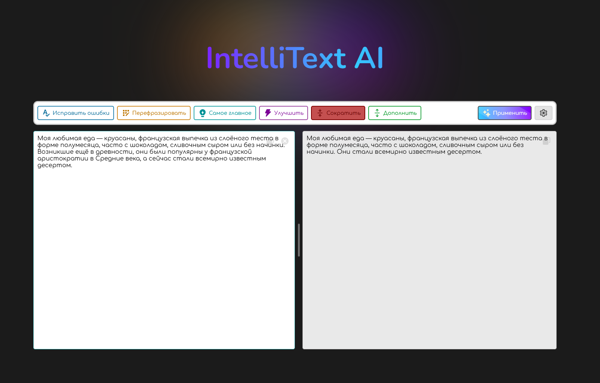

# 🚀 IntelliText AI — Умный рерайтер текста с ИИ

[](https://vuejs.org/) [](https://www.typescriptlang.org/) [](https://vitejs.dev/) [](https://sass-scss.ru/documentation/)

**Преобразуйте текст мгновенно!**  
Рерайтинг, исправление ошибок, сокращение и улучшение текста с поддержкой ИИ-моделей.



## ✨ Особенности

- ⚡ **Сверхбыстрая работа** благодаря Vite и Vue 3
- 🧠 **Интеграция с ИИ-моделями** (Mistral/DeepSeek и другие)
- 🛠️ **Гибкие настройки**:
  - Кастомизация системных промптов
  - Выбор модели ИИ
  - Поддержка API ключей
- ⌨️ **Удобное управление**:
  - Растягиваемая текстовая область
  - Быстрое копирование/удаление текста
- 📈 **Улучшенная генерация** с индикацией прогресса

---

## 🚀 Быстрый старт

1. **Установите репозиторий**:
   ```bash
   git clone https://github.com/V0xDev/intelli-text-ai.git
   cd intelli-text-ai
   ```
2. **Установите зависимости**:
   ```bash
   yarn install  # или npm install
   ```
3. **Запустите приложение**:
   ```bash
   yarn dev     # или npm run dev
   ```
   Откройте http://localhost:5173 в браузере.

---

## ⚙️ Настройка ИИ

- Нажмите на шестеренку в правом верхнем углу.

- Перейдите в раздел «Настройки модели».

- Выберите провайдера (например, OpenAI) и введите API-ключ.

```bash
🔑 Пример ключа OpenAI: sk-xxxxxxxxxxxxxxxxxxxxxxxxxxxxxxxx
```

- Нажмите на клавишу "Сохранить"

---

## 🎮 Как использовать

- Введите текст в поле (до 2000 символов).

- Выберите действие:

- Исправить ошибки — автоматическое исправление опечаток.

- Перефразировать — изменить структуру, сохранив смысл.

- Сократить — уменьшить объем текста.

- Улучшить стиль — сделать текст более выразительным.

- Дополнить — добавить деталей или примеров.

- Нажмите «Применить» для запуска.

- Результат появится через `5-15` секунд, в зависимости от нагруженности выбранного вами сервера и модели генерации

---

## 🤝 Поддерживаемые модели

###### На данный момент внедрены настройки для следующих моделей:

- ##### Microsoft:

  - phi-3-medium-128k-instruct:free

- ##### Mistral:

  - mistral-7b-instruct:free
  - mistral-small-24b-instruct-2501:free
  - mistral-free (pro)

- ##### Deepseek:
  - deepseek-r1:free

###### Кастомные модели: добавьте конфигурацию в `src/shared/models.settings.ts`

---

## 📜 Лицензия

Проект распространяется под лицензией MIT.

---

## 💡 Вопросы или предложения?

Оставляйте их в Issues.
